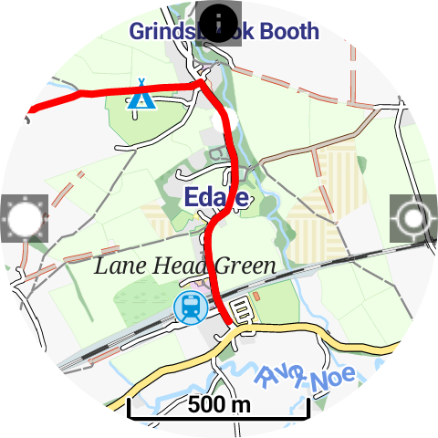
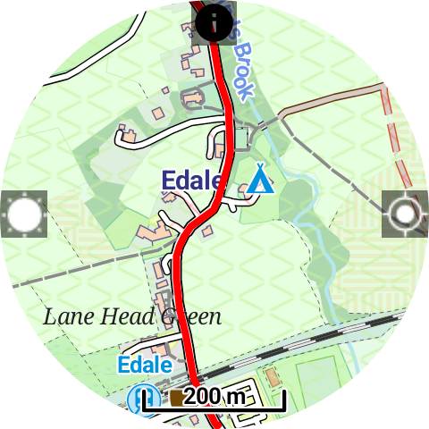

# Wear OS Offline Maps & GPX Tracker (Fork)

This project is a **fork** of the original [offlinemaps](https://github.com/miki151/offlinemaps) Wear OS app, with updates and improvements.

This simple Wear OS app allows you to:

* Download OSM maps of the whole world for offline use.  
* Import GPX files into the watch and display them on the map for navigation.

  
  
  
  

---

## Features

Designed for hiking, trail running, and other outdoor sports:

* Prevent the screen from dimming for continuous navigation.  
* Disable touch input, useful in rain or if clothing covers the screen.  
* Display progress along an active GPX track (now shown in **miles**).  

---

## GPX Import Methods

Currently, GPX tracks can be imported in the following ways:

1. **OpenStreetMap Traces (Recommended)**  
   - Tracks must include elevation and time data.  
   - Use [GPX.studio](https://gpx.studio) if your GPX doesn’t include elevation/time — it can add this automatically.  
   - Then upload the updated GPX to OpenStreetMap and make it public.  
   - Copy the numeric ID from the OSM trace URL, e.g.:  
     ```
     https://www.openstreetmap.org/traces/12056327/data
     ```  
     Here `12056327` is the ID you enter in the app.  
   - The app downloads the GPX from OSM and displays it on your watch.  
   - **Tip:** OSM is currently the most reliable method, but keep Bugjaeger in mind as OSM may change APIs or access in the future.  

2. **Manual import using Bugjaeger**  
   - Install [Bugjaeger](https://play.google.com/store/apps/details?id=eu.sisik.hackendebug) on your phone and pair via wireless debugging.  
   - Keep your watch on charge.  
   - Navigate to:  
     ```
     storage/emulated/0/Android/Data/com.keeperrl.offlinemapsforwearos/files/download
     ```  
   - At the top of Bugjaeger, click the **up arrow** and import the GPX file you want.  

> **Note:** RWGPS and Pastebin imports have been removed until further fixes are implemented.  

---

## Instructions

1. Download the `OfflineMaps.apk` file from this repository and sideload it onto your watch.  
   - **This APK is the most up-to-date version.**  
2. Run the app and enable GPS permission.  
3. Tap and hold the screen to enter the menu.  
   - From here you can **download maps** or **import GPX files**.  
   - It’s recommended to install the map first, then add your GPX file.  
4. When the map is downloaded and location is acquired, the map will display on the screen. Swipe to scroll and use rotation input (physical bezel, touch bezel, crown) to zoom in/out.  
5. Once a GPX file is uploaded and selected, click on its name to activate it — it will now be shown on the map.  
6. Click the "sun" icon on the left to prevent the screen from dimming.  
7. Click the "info" icon on top to toggle the information overlay (clock, battery, track progress).  
8. Click the "location" icon on the right to stop the map from centering on your location.  
9. Press the back button to toggle touch input (a "lock" icon appears when touch is disabled).  

---

## Changelog (Fork Updates)

* Forked from [offlinemaps](https://github.com/keeperrl/offlinemaps).  
* Removed RWGPS and Pastebin imports (unreliable).  
* Added OpenStreetMap trace import support.  
* Changed GPX overlay distance units from **kilometers → miles**.  
* Updated background colors from the original.  

---

## Credits

This app was made possible thanks to the [Mapsforge library](https://github.com/mapsforge/mapsforge).
